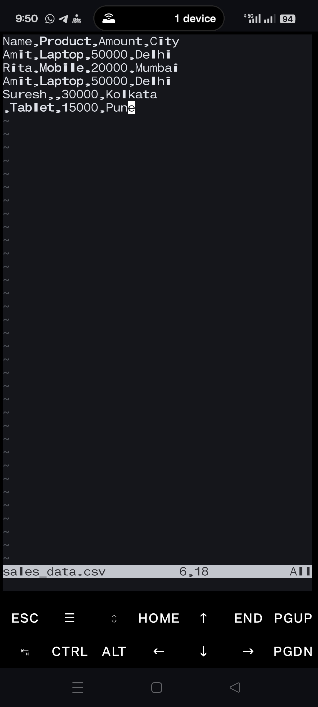

---

📊 CSV to Excel Automation Project

🔹 Project Overview

This project is a client-ready CSV to Excel automation system built using Python and Pandas.

It is designed to:

Validate incoming CSV files

Normalize column names (even if clients use different naming styles)

Clean duplicate and invalid records

Generate structured Excel reports

Organize outputs client-wise and date-wise

Maintain execution logs for auditing and debugging

The same script can be reused for multiple clients without changing code.

---

🔹 Problem Statement

Clients often provide CSV files with:

Different column names (CustomerName, NAME, name, etc.)

Duplicate records

Missing critical data

No standard output format

Manually cleaning and converting such data is:

Time-consuming

Error-prone

Not scalable

---

🔹 Solution Provided

This automation script:

Accepts a CSV file as input

Automatically standardizes column names

Validates required columns

Removes duplicates and invalid rows

Exports a clean Excel report

Stores outputs in a structured folder system

Logs all operations

---

🔹 Features

✔ Column normalization using aliases
✔ Required column validation
✔ Duplicate removal
✔ Missing data handling
✔ Client-wise output folders
✔ Date-wise report organization
✔ Detailed logging (logs/automation.log)
✔ Reusable for multiple clients

---

🔹 Project Structure

02-csv-excel-automation/
│
├── csv_to_excel_automation.py   # Main automation script
├── config.py                    # Client & column configuration
├── README.md                    # Project documentation
│
├── data/
│   └── sales_data.csv           # Input CSV file
│
├── output/
│   └── ABC_Traders/
│       └── 2025-12-20/
│           └── clean_sales_report.xlsx
│
├── logs/
│   └── automation.log           # Execution logs
│
└── screenshots/
    ├── before_csv.jpg
    ├── after_excel.jpg
    └── run_log.jpg

---

🔹 Configuration (config.py)

Client-specific details are stored in config.py.

Example:

CLIENT_NAME = "ABC Traders"
INPUT_FILE = "data/sales_data.csv"
OUTPUT_FILE = "clean_sales_report.xlsx"

REQUIRED_COLUMNS = ["Name", "Product", "Amount", "City"]

COLUMN_ALIASES = {
    "Name": ["CustomerName", "customer_name", "NAME", "name"],
    "Product": ["product", "Item", "item_name"],
    "Amount": ["amount", "Price", "Total", "total_amount"],
    "City": ["city", "Location"]
}

👉 To onboard a new client, only this file needs to be updated.

---
# Screenshots

### Before (Raw CSV)

### After (Clean Excel)

---

🔹 Use Cases

Sales data cleaning

Client report automation

Data preprocessing for analytics

Freelance automation projects

Small business reporting tools

---

🔹 Author

Developed by Jitendra Bharti
Python Automation | Data Processing | Freelance-Ready Projects

---

