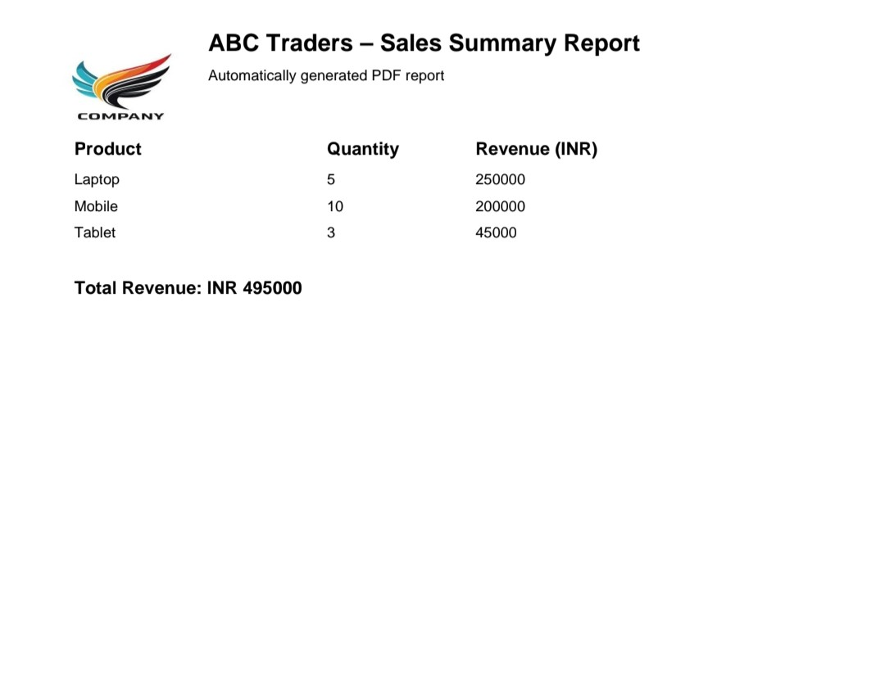

# 📄 PDF Sales Report Generator (Python Automation)

Professional Python automation that converts structured CSV sales data into a clean, formatted PDF report with automatic totals.

Designed for freelancers, businesses, and client deliverables.

---

## 🚀 Features

✔ Reads CSV sales data  
✔ Generates professional PDF reports  
✔ Calculates total revenue automatically  
✔ Safe re-runs (PDF overwritten cleanly)  
✔ CLI configurable (input, output, title)  
✔ Logging for traceability  
✔ Client branding support (logo & header)
✔ Professional, client-ready PDF layout
---
🔖 Branding:
The PDF supports company logo integration.
Clients can provide their logo (PNG/JPG), which is automatically embedded in the report header.
## 📁 Project Structure

03-pdf-report-generator/
├── data/
│   └── sales_summary.csv
├── output/
│   └── sales_report.pdf
├── pdf_report.py
├── report.log
└── README.md

---

## 🖼️ Before & After (PDF Output)

### Before (Raw CSV Data)


### After (Branded PDF Report)


These screenshots demonstrate the complete automation pipeline —
from raw input data to a branded, client-ready PDF report.

## 🧾 Input CSV Format

```csv
Product,Quantity,Revenue
Laptop,5,250000
Mobile,10,200000
Tablet,3,45000

▶️ How to Run
pip install reportlab
python pdf_report.py
Custom run (client-ready):
Bash
python pdf_report.py --input data/sales_summary.csv \
                     --output output/sales_report.pdf \
                     --title "Monthly Sales Report"
📊 Output
✔ Professional PDF report
✔ Revenue totals with currency formatting
✔ Multi-page handling
🧠 Automation Design
(6-Step)
Input configuration
Validation
PDF setup
Data processing
Business logic
Final save & reporting
💼 Freelance Use Cases
• Sales summary reports
• Invoice / billing PDFs
• Monthly business reports
• Client-branded deliverables
💰 Typical pricing:
Basic PDF automation: ₹1500–2000
Branded & formatted reports: ₹2500–4000

👨‍💻 Author
Jitendra Bharti
Python Automation Developer
Freelancing-ready automation systems
