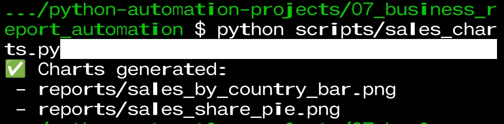

---

📸 Screenshots — Business Sales Report Automation

This document provides visual proof of execution and deliverables generated by the automation scripts in Project-07.

All outputs shown below are fully auto-generated using Python scripts.
No manual editing of CSV files or charts was performed.

---

✅ Step 1 — Data Cleaning Automation

Script used:
scripts/load_and_clean.py

What this step proves:

Raw sales data is loaded

Invalid / missing rows are removed

Clean data is saved automatically to reports/clean_sales_data.csv

Execution proof:

---

✅ Step 2 — Sales Summary (Terminal Report)

Script used:
scripts/sales_summary.py

Business questions answered:

Total number of orders

Total sales amount

Country-wise sales aggregation

Terminal output proof:

---

✅ Step 3 — Charts Generation Automation

Script used:
scripts/sales_charts.py

Charts generated automatically:

Bar Chart — Sales by Country

Pie Chart — Sales Share Distribution

Charts are saved directly into the reports/ folder.

Execution proof (terminal):

---

📊 Final Deliverables Preview

The following outputs are generated and saved automatically inside the reports/ folder:

clean_sales_data.csv

country_sales_summary.csv

sales_by_country_bar.png

sales_share_pie.png

Preview of generated reports and charts:

---

📝 Notes for Reviewers / Clients

All screenshots are taken immediately after script execution

No manual intervention in data, CSVs, or charts

Scripts are reusable and scalable for larger datasets

This project follows a client-ready reporting workflow

---

🧠 Project Intent

This project demonstrates:

Data cleaning automation

Business-focused reporting

Chart generation without manual work

Production-style folder structure

Freelance-ready delivery mindset

---

✅ Status: Completed & Verified
📦 Deliverables: Ready for client use

---

## Step 2 – Charts Generation Proof

This screenshot shows automatic generation of bar and pie charts
using `sales_charts.py`.

